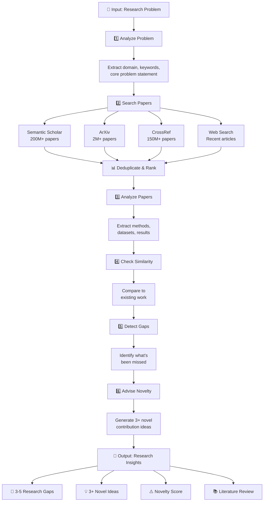

# 🔬 Research Gap Finder

> **Discover what exists, find what doesn't, publish what matters.**

A cutting-edge AI-powered application that helps researchers identify gaps in existing literature and discover novel research opportunities. Using multiple academic data sources and LangGraph orchestrated AI agents, Research Gap Finder analyzes your research problem and provides actionable insights for publication.

---

## ✨ Key Features

- **🔍 Multi-Source Paper Search** - Searches 380M+ academic papers across Semantic Scholar, ArXiv, CrossRef, and web sources
- **🤖 AI-Powered Analysis** - 6 specialized agents analyze problems, papers, and identify gaps
- **📊 Research Gap Detection** - Automatically identifies unexplored areas and contradictions in literature
- **💡 Novel Contribution Ideas** - Generates 3+ publication-ready research directions
- **⚡ Fast & Interactive** - Real-time analysis with progress tracking (60-90 seconds)
- **📈 Similarity Analysis** - Evaluates how novel your idea is compared to existing work
- **📝 Literature Review Generation** - Automatic academic writing capabilities (optional)

---

## 🏗️ Architecture

```
┌─────────────────────────────────────────────────────────────────────┐
│                          Research Gap Finder                        │
└─────────────────────────────────────────────────────────────────────┘
                                  │
                    ┌─────────────┴─────────────┐
                    │                           │
           ┌────────▼────────┐        ┌────────▼────────┐
           │ Streamlit UI    │        │  LangGraph      │
           │ (Frontend)      │        │  (Orchestration)│
           └────────┬────────┘        └────────┬────────┘
                    │                          │
         ┌──────────┴──────────┐               │
         │                     │               │
    ┌────▼────┐         ┌──────▼──────┐       │
    │ Input   │         │ 6 AI Agents │◄──────┘
    │ Problem │         └──────┬──────┘
    └────┬────┘                │
         │         ┌───────────┼───────────┬────────────┐
         │         │           │           │            │
    ┌────▼────┬────▼──┬────────▼─┬────────▼─┬──────────▼┐
    │ Problem │ Paper │ Similarity│   Gap    │  Novelty  │
    │ Analyzer│Searcher│ Checker   │ Detector │  Advisor  │
    └────┬────┴────┬──┴────────┬─┴────────┬─┴──────────┬┘
         │         │          │          │            │
    ┌────▼─────────▼──────────▼──────────▼────────────▼──┐
    │         Groq Llama 3.3 70B LLM                     │
    └──────────────────────────────────────────────────┘
         │
    ┌────┴────────────────────────────┐
    │    Academic Data Sources         │
    ├──────────────────────────────────┤
    │ • Semantic Scholar (200M+)       │
    │ • ArXiv (2M+ CS/AI papers)       │
    │ • CrossRef (150M+ with DOIs)     │
    │ • Tavily Web Search              │
    └──────────────────────────────────┘
```

---

## 🔄 Research Analysis Workflow



---

## 🚀 Quick Start

### Prerequisites

- Python 3.10+
- API Keys:
  - **Groq API Key** - Free at [console.groq.com](https://console.groq.com)
  - **Tavily API Key** - Free at [tavily.com](https://tavily.com)

### Installation

1. **Clone the repository**
   ```bash
   git clone https://github.com/yourusername/research-gap-finder.git
   cd research-gap-finder
   ```

2. **Create virtual environment**
   ```bash
   python -m venv venv
   source venv/bin/activate  # On Windows: venv\Scripts\activate
   ```

3. **Install dependencies**
   ```bash
   pip install -r requirements.txt
   ```

4. **Configure environment**
   Create a `.env` file in the project root:
   ```env
   GROQ_API_KEY=your_groq_api_key_here
   TAVILY_API_KEY=your_tavily_api_key_here
   ```

5. **Run the application**
   ```bash
   streamlit run app.py
   ```
   
   The app will open at `http://localhost:8501`

---

## 💻 Usage

### Basic Workflow

1. **Enter your research problem**
   ```
   Example: "Real-time crowd density estimation using egocentric cameras"
   ```

2. **Click "Find Research Gaps"**
   - Analysis takes 60-90 seconds
   - Real-time progress updates

3. **Review results**
   - What's been done
   - Research gaps
   - Novel contribution ideas
   - Novelty score (1-10)

### Output Example

```
RESEARCH GAPS
─────────────
Gap 1: No real-time egocentric crowd counting on mobile devices
  Why it matters: Enables smartphone-based crowd monitoring
  Difficulty: Medium
  Evidence: All papers use fixed cameras or offline processing

Gap 2: Cross-dataset generalization for egocentric viewpoint
  Why it matters: Models trained on one dataset fail on others
  Difficulty: Hard
  Evidence: Paper comparison shows 15-20% performance drop

NOVEL CONTRIBUTION IDEAS
──────────────────────
Idea 1: Mobile-Optimized Egocentric Crowd Counter
  - What: Lightweight model for smartphone real-time counting
  - Target: ICCV / CVPR
  - Estimated difficulty: Medium (2-3 months)
```

---

## 📊 System Components

### 1. **Problem Analyzer Agent**
Understands the research domain and extracts key concepts
- Extracts domain and keywords
- Generates search queries
- Identifies core problem

### 2. **Paper Searcher**
Queries 380M+ academic papers across multiple sources
- Semantic Scholar: 200M+ papers
- ArXiv: 2M+ CS/AI papers
- CrossRef: 150M+ papers with DOIs
- Tavily: Recent web articles

### 3. **Paper Analysis Agent**
Deep analysis of retrieved papers
- Extracts methods and datasets
- Compares methodologies
- Rates coverage (1-10 scale)
- Creates methodology comparison table

### 4. **Similarity Checker**
Evaluates novelty of research idea
- Jaccard similarity with existing papers
- Top 5 most similar works
- Identifies closest competitors

### 5. **Gap Detection Agent**
Identifies research gaps and missed opportunities
- Lists 3-5 specific gaps
- Notes contradictions in literature
- Highlights weaknesses in existing work
- Provides evidence from papers

### 6. **Novelty Advisor Agent**
Generates novel research directions
- 3+ publishable contribution ideas
- Target venues (journals/conferences)
- Estimated difficulty and timeline
- Recommended next steps

---

## 🛠️ Tech Stack

| Layer | Technology | Purpose |
|-------|-----------|---------|
| **Frontend** | Streamlit | Interactive web interface |
| **Orchestration** | LangGraph | AI workflow management |
| **LLM** | Groq Llama 3.3 70B | Language understanding & generation |
| **Framework** | LangChain | LLM abstractions & tools |
| **Data Sources** | Semantic Scholar, ArXiv, CrossRef | Academic papers |
| **Search** | Tavily API | Web search & recent articles |
| **Language** | Python 3.10+ | Backend implementation |

---

## 📋 Dependencies

```
langgraph          # Agentic workflow orchestration
langchain          # LLM framework
langchain-groq     # Groq integration
langchain-community # Additional tools
tavily-python      # Web search API
streamlit          # Web UI framework
arxiv              # ArXiv paper search
requests           # HTTP requests
python-dotenv      # Environment variables
```

---

## 🔐 API Keys & Authentication

### Groq (Free)
1. Visit [console.groq.com](https://console.groq.com)
2. Create account
3. Generate API key
4. Add to `.env` file

### Tavily (Free)
1. Visit [tavily.com](https://tavily.com)
2. Sign up
3. Get API key
4. Add to `.env` file

**Note:** All other data sources (Semantic Scholar, ArXiv, CrossRef) are free and don't require API keys.

---

## 📁 Project Structure

```
research-gap-finder/
├── app.py                  # Streamlit UI application
├── graph.py               # LangGraph workflow orchestration
├── agents.py              # 6 AI agents (analysis, detection, etc.)
├── tools.py               # Data source integrations
├── requirements.txt       # Python dependencies
├── Dockerfile             # Container configuration
├── .env.example          # Environment variables template
└── README.md             # This file
```

---

## 🎨 UI Features

### Sidebar
- **How It Works** - Step-by-step overview
- **Data Sources** - Breakdown of paper databases
- **Results Summary** - Paper counts and statistics
- **Quick Actions** - New search button

### Main Interface
- **Research Problem Input** - Large text area with examples
- **Real-time Progress** - Status updates during analysis
- **Results Display**
  - Papers found (sortable)
  - Analysis breakdown
  - Gap identification
  - Novel ideas with venue recommendations
  - Literature review (expandable)

### Visual Styling
- Color-coded cards (gaps, novelty, papers)
- Source badges (Semantic Scholar, ArXiv, etc.)
- Progress indicators
- Status badges

---

## 🔄 Workflow Details

### Phase 1: Problem Understanding
- Analyzes your research query
- Extracts domain and keywords
- Generates optimized search queries

### Phase 2: Information Gathering
- Parallel searches across 4 data sources
- Deduplication and ranking
- ~20-25 unique papers retrieved

### Phase 3: Deep Analysis
- Methodology extraction
- Dataset identification
- Performance metric comparison
- Coverage assessment (1-10 scale)

### Phase 4: Gap Detection
- Identifies unexplored areas
- Finds contradictions in literature
- Highlights method weaknesses
- Notes missing datasets

### Phase 5: Novelty Assessment
- Similarity scoring
- Novelty scoring (1-10)
- Risk assessment
- 3+ publication-ready ideas

### Phase 6: Guidance
- Recommended next steps
- Timeline estimates
- Target venues
- Implementation difficulty

---

## 💡 Use Cases

### For Ph.D. Students
- Narrow down research topic
- Find gaps before starting literature review
- Identify novel contributions
- Compare with existing work

### For Researchers
- Stay updated on latest papers
- Discover emerging research areas
- Plan novel research directions
- Avoid duplicating existing work

### For Academic Writers
- Generate literature review sections
- Identify state-of-the-art
- Find research contradictions
- Suggest future work directions

### For Industry Researchers
- Monitor academic progress
- Identify patentable ideas
- Benchmark against research
- Plan R&D roadmaps

---

## ⚙️ Configuration

### Streamlit Config
Modify `~/.streamlit/config.toml`:
```toml
[theme]
primaryColor = "#FF6B35"
backgroundColor = "#FFFFFF"
secondaryBackgroundColor = "#F0F2F6"
textColor = "#262730"
```

### LangGraph Settings
Adjust in `graph.py`:
- Number of papers per source (currently 6-8)
- Similarity threshold
- Gap detection sensitivity

### LLM Parameters
Modify in `agents.py`:
- Temperature (currently 0.1 for deterministic results)
- Model (currently Llama 3.3 70B)
- Prompt templates

---

## 🚨 Troubleshooting

### API Errors
| Error | Solution |
|-------|----------|
| `GROQ_API_KEY not found` | Add to `.env` file |
| `Tavily API error` | Check API key validity |
| `Semantic Scholar timeout` | Retry or reduce limit |
| `ArXiv connection failed` | Check internet connection |

### Performance Issues
- **Slow response**: Increase timeout or reduce paper limit
- **Memory error**: Reduce number of papers analyzed
- **UI lag**: Clear Streamlit cache (`streamlit cache clear`)

---

## 📈 Performance Metrics

- **Average analysis time**: 60-90 seconds
- **Papers retrieved**: ~20-25 unique papers
- **Coverage**: 380M+ academic papers
- **Accuracy**: Based on LLM quality (Llama 3.3 70B)

---

## 🔮 Roadmap

- [ ] Support for more LLMs (GPT-4, Claude)
- [ ] Database caching for repeated searches
- [ ] Export to PDF/Word formats
- [ ] Collaborative features (team research)
- [ ] Citation management integration
- [ ] Multi-language support
- [ ] Graph visualization of paper relationships
- [ ] Research trend analysis

---

## 🤝 Contributing

Contributions are welcome! Please:

1. Fork the repository
2. Create a feature branch
3. Make your changes
4. Add tests if applicable
5. Submit a pull request

---

## 📄 License

MIT License - feel free to use this for personal and commercial projects.

---

## 🙏 Acknowledgments

- **Groq** - LLM inference
- **Semantic Scholar** - Paper database
- **ArXiv** - Preprints
- **CrossRef** - Paper metadata
- **LangChain & LangGraph** - AI frameworks
- **Streamlit** - UI framework

---

## 📧 Contact & Support

- **Issues** - GitHub Issues
- **Email** - ranaahmadraza7863@gmail.com
- **Documentation** - [Full docs](https://github.com/Ahmadraza880/research-gap-finder)

---

## 🌟 Star History

If this tool helps with your research, please star the repository!

---

**Last Updated:** May 2026 | **Version:** 1.0.0 | **Status:** ✅ Production Ready

